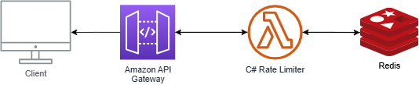

# RatLimiter

## What is this project and who is it for?

* Primary user: a developer who owns an API and wants to protect their API from abuse.
* Secondary user: myself, as a learner, who seeks to upskill, explore distributed patterns, Redis and full-stack concepts.

## Why Cloud APIs use rate limiters?

* Maintain quality of service to all users by preventing spikes of activity.
* Preventing overload and maintaining stable and responsive API by preventing any single user overflowing the server with requests.
* Increase of security by mitigating Distributed Denial Of Service (DDoS).
* Limiting the requests should also assist with costs considerations and excessive use of resources.

## Constraints and assumptions:

* This will lean heavily on free cloud resources since this is mostly for learning and upskill.
* This will be a single region application.

## Goals for MVP:

* Support token-bucket rate limiting per API key.
* Store rate limit configuration per key.
* Expose HTTP endpoint to check/consume tokens.
* Provide a simple React dashboard to view and configure limits.
* Deploy to a free cloud environment with Redis.
* I will likely start implementing the token bucket algorithm first. This seems to be a pretty straight forward algorithm with a manageable workload that will allow me to dip in the concept.

